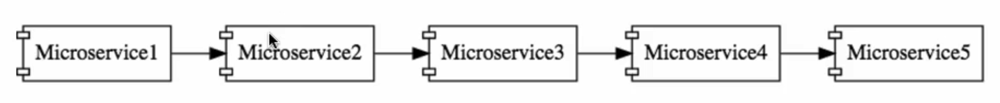

## Advantages of Microservices Architecture

2. It enables you to adapt new technology and processes very easily
    
    - When we build applications as a combinations of microservices which can communicate with each other using simple messages.
      
    - Each of these microservices can be built in different technologies.

    - Whereas in typical monolith applications we would not have this flexibility. 
   
    - For example, Microservice1 might be written Java, Microservice2 might be written with NodeJS, Microservice3 might be written in Kotlin and tommorow there might be a language XYZ which provides a lot of benefits to you - and you can easily create a microservice in that specific language.      

3. Dynamic scaling

   - Consider an online shopping application, like Amazon. They don't really have the same amount of (load/traffic/amount of users) throughout the year. Especially during the holiday season - the load on the application will be very high, but during the rest of the year there might not be so much load.
   
   - If your microservices are cloud enabled, they can scale dynamically and you can procure/release hardware dynamically as well. So you can scale up and down your microservices based on the load.

4. Fast release cycles

   - Because you're developing small components, it's much easier/faster to release microservices compared to monolith applications.

   - This means that you can bring new features faster to market (this is a big advantage to have in the modern world)