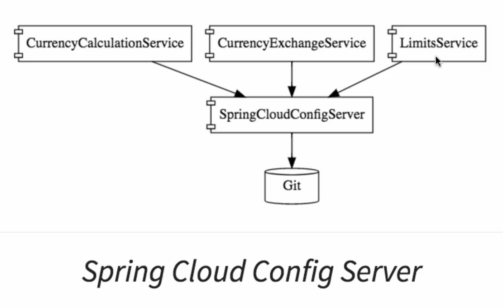
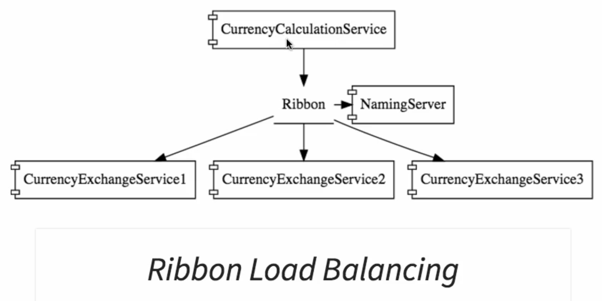

## Components of Spring Cloud
**Components of Spring Cloud** => provide solutions to the challenges of microservices we discussed

1. **Configuration Management** => _Spring Cloud Config Server_

    - In microservice architecture, we have multiple microservices, multiple environments for each of these microservices and multiple instances in many of those environments. Therefore, there would be a lot of configuration for these microservices that the operations team needs to manage.
    
    - _Spring Cloud Config Server_ => provides an approach where you can store all the configuration for all the different environments of all the microservices in a GIT repository (centralised location).
    

    -  This helps us keep the configuration in one place and that makes it very easy to maintain the configuration for all microservices. 

2. **Dynamic scale up and scale down** => _Eureka_ (Naming Server), _Ribbon_ (Client Side Load Balancing), _Feign_ (Easier REST Clients)

    - Microservice ("CurrencyCalculationService") talks to another microservice ("CurrencyExchangeService"). There are mutliple instances of ("CurrencyExchangeService"). 

    - It is also possible that at any point in time new instances can be added in or removed out.
      

    - We would want the ("CurrencyCalculationService") to be able to distribute the load between all the instances of the ("CurrencyExchangeService").
        
    - By dynamically checking what are the available instances of the ("CurrencyExchangeService") and make sure that the load is distributed amongst all of them
    
    - Solution to dynamic scale up and scale down use the following technologies:

        - **Eureka** (Naming Server) => all the instances of all microservices would register with the naming server. It's two important features are:
          - Service registration => all microservices can register with the Naming Server
          - Service discovery => ("CurrencyCalculationService") can ask the Eureka Naming Server for current instances of ("CurrencyExchangeService"). Naming Server would provide those URLs for the ("CurrencyCalculationService"). This helps to establish dynamic relationship between the ("CurrencyCalculationService") and the instances of the ("CurrencyExchangeService")    
        - **Ribbon** (Client Side Load Balancing) => ("CurrencyCalculationService") will host Ribbon. It will make sure that the load is evenly distributed amongst the existing instances that it gets from the Naming Server.
        - **Feign** (Easier REST Clients) => it will be used in the ("CurrencyCalculationService") as a mechanism to write simple RESTful clients

3. **Visibility and Monitoring** => _Zipkin Distributed Tracing Server_, _Netflix Zuul API Gateway_ 

    - _Zipkin Distributed Tracing Server_ => using Spring Cloud Sleuth we would assign an ID to a request across multiple components. Zipkin Distributed Tracing would be used to trace a request across multiple components.
   
    - _Netflix Zuul API Gateway_ => One of the important things about microservices is that these microservices have a lot of common features, for example: logging, security, analytics. You don't want to implement all these common features in every microservice. Netflix Zuul API Gateway provide great solutions to these kind of challenges.

4. **Fault tolerance** => _Hystrix_

    - _Hystrix_ => it is used to implement fault tolerance. If a microservice is down, Hystrix helps us to configure a default response.  
