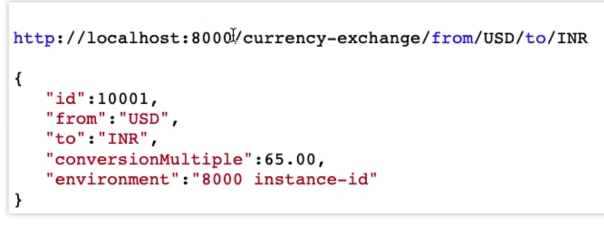
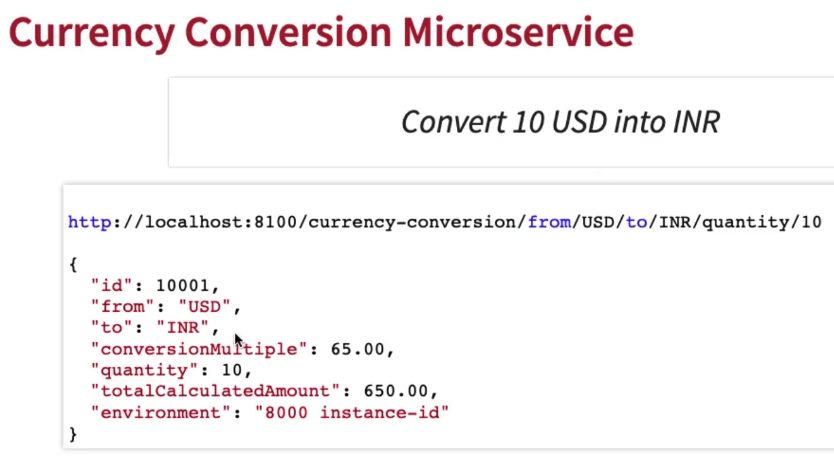
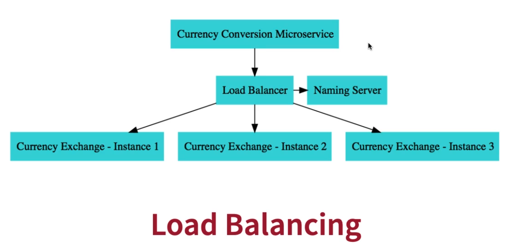

## Application structure Overview

We're building a complex disitrubted system => with (mutliple microservices, naming server, api gateway, distributed tracing, ...)

Overall structure of the project:

1. Microservice 1: Currency Exchange Microservice => what is the exchange rate of one currency to another

   - From this microservice we will be exposing a simple URL:

   

2. Microservice 2: Currency Conversion Microservice => convering 10 USD into INR

   - From this microservice we will be exposing a simple URL:

   

   - For the (Currency Conversion Microservice) to provide its featurs, it will call the (Currency Exchange Microservice)

   - It will ask what is the value of USD in INR today?

   - Then it would take the return value and multiply it with 10 (based on our request to convert 10 USD into INR).

## Load Balancing

- Later, we will have multiple instances of (CurrencyConversionMicroservice) and (CurrencyExchangeMicroservice)
- When calling from (CurrencyConversionMicroservice), I would need to know:
  - which instance of the (CurrencyExchangeMicroservice) is providing the response
  - is instance 1 of (CurrencyExchangeMicroservice) runnnig on port 8000 or 8001 or 8002
- That would help us identify whether our load balancers and naming servers are working properly

  
