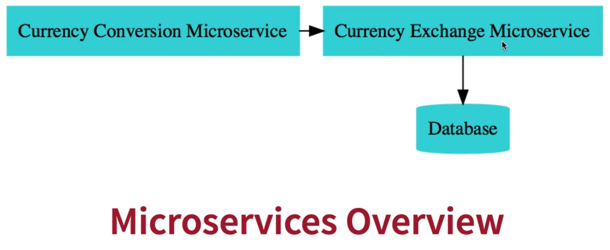
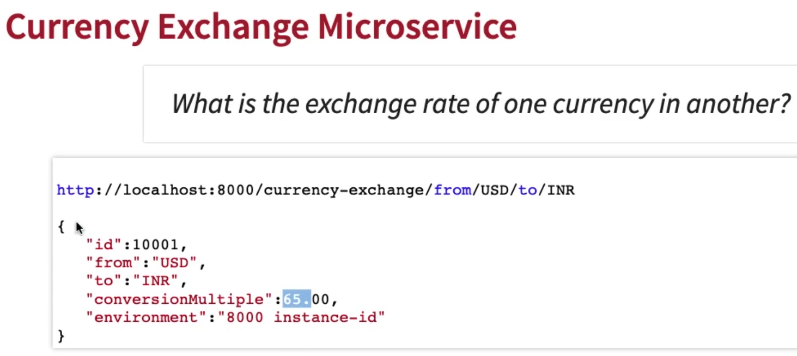
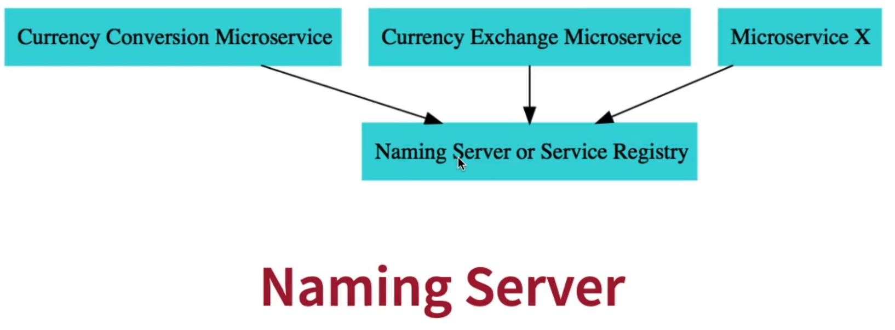
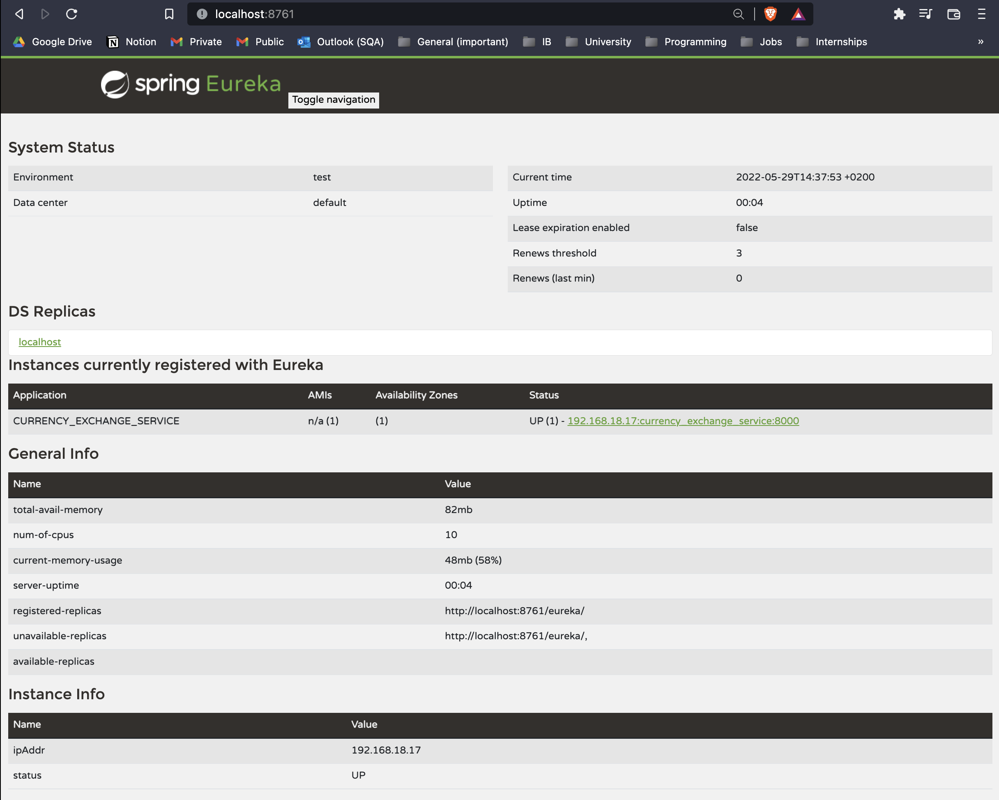
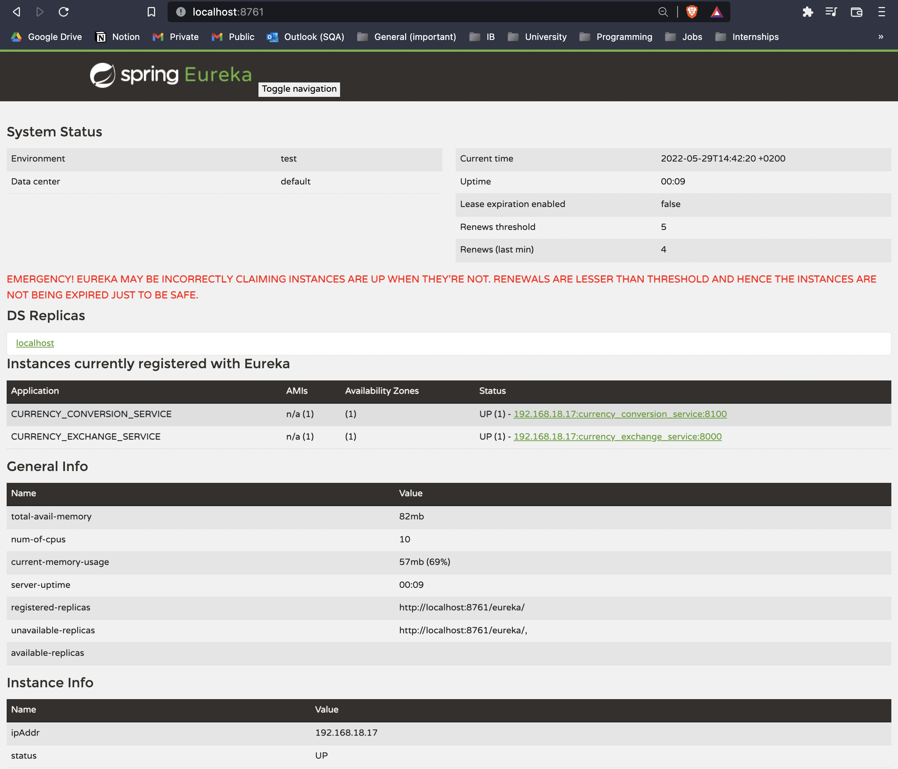
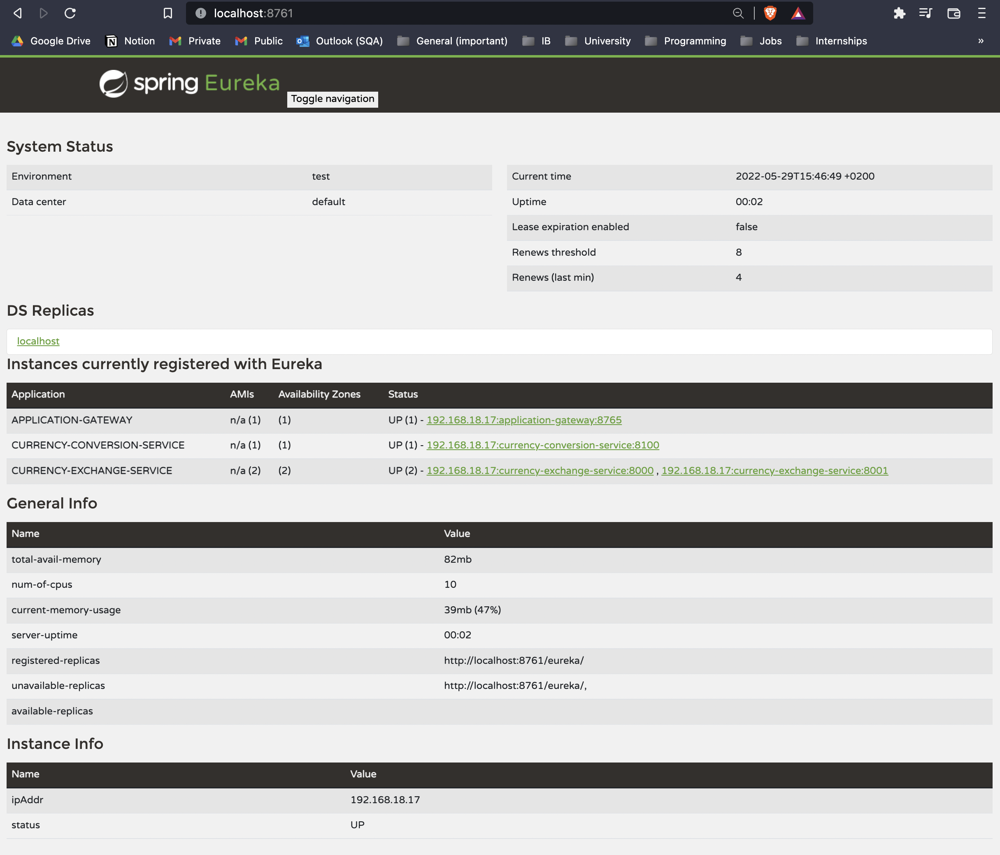
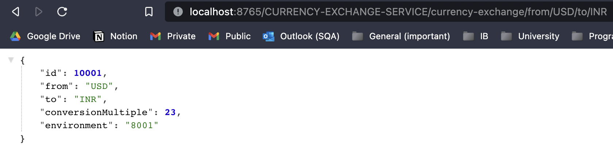
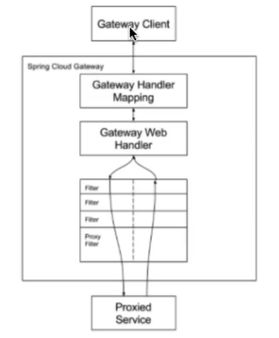

## Application structure Overview

We're building a complex disitrubted system => with (mutliple microservices, naming server, api gateway, distributed tracing, ...)

Overall structure of the project:



1. Microservice 1: (first Spring Boot Application) Currency Exchange Microservice => what is the exchange rate of one currency to another

   - From this microservice we will be exposing a simple URL:

   

2. Microservice 2: (second Spring Boot Application) Currency Conversion Microservice => convering 10 USD into INR

   - From this microservice we will be exposing a simple URL:

   

   - For the (Currency Conversion Microservice) to provide its featurs, it will call the (Currency Exchange Microservice)

   - It will ask what is the value of USD in INR today?

   - Then it would take the return value and multiply it with 10 (based on our request to convert 10 USD into INR).

## Load Balancing

- Later, we will have multiple instances of (CurrencyConversionMicroservice) and (CurrencyExchangeMicroservice)
- When calling from (CurrencyConversionMicroservice), I would need to know:
  - which instance of the (CurrencyExchangeMicroservice) is providing the response
  - is instance 1 of (CurrencyExchangeMicroservice) runnnig on port 8000 or 8001 or 8002
- That would help us identify whether our load balancers and naming servers are working properly

  

### Running multiple instances of microservice = is same as running the same SpringBoot app on different ports

This can be achieved by, going into editing Run/Debug Configurations in InteliJ.

1. You copy the application
2. Rename it, so:

   - first application => CurrencyExchangeServiceApplication 8000
   - second application => CurrencyExchangeServiceApplication 8001

     Configure this 2nd application to run on port 8001. Click Modify options -> Click Add VM options -> Paste -Dserver.port=8001

     Whatever you provide here as an environment variable, it would override whatever is configured in application.properties

We can return the port details to our client by @Autowired the Environment class provided by SpringBoot in any of our controllers:

```
import org.springframework.beans.factory.annotation.Autowired;
import org.springframework.core.env.Environment;
import org.springframework.web.bind.annotation.GetMapping;
import org.springframework.web.bind.annotation.PathVariable;
import org.springframework.web.bind.annotation.RequestMapping;
import org.springframework.web.bind.annotation.RestController;

import java.math.BigDecimal;

@RestController
@RequestMapping(path="currency-exchange")
public class CurrencyExchangeController {

    @Autowired
    private Environment environment;

    @GetMapping("from/{from}/to/{to}")
    public CurrencyExchange retrieveExchangeValue(@PathVariable String from, @PathVariable String to) {
        CurrencyExchange currencyExchange = new CurrencyExchange(1000L, from, to, BigDecimal.valueOf(50));
        String port = this.environment.getProperty("local.server.port");
        currencyExchange.setEnvironment(port);
        return currencyExchange;
    }
}
```

## Calling one microserivce (CurrencyExchangeMicroservice) from another microservice (CurrencyConversionMicroservice)

- This is done using _RestTemplate_ which allows us to make REST API calls.

- Below is a code for a controller of the 'CurrencyConversionMicroservice' microservice in which a method is calling the 'CurrencyExchangeMicroservice'

```
import org.springframework.http.ResponseEntity;
import org.springframework.web.bind.annotation.GetMapping;
import org.springframework.web.bind.annotation.PathVariable;
import org.springframework.web.bind.annotation.RequestMapping;
import org.springframework.web.bind.annotation.RestController;
import org.springframework.web.client.RestTemplate;

import java.math.BigDecimal;
import java.util.HashMap;

@RestController
@RequestMapping(path="currency-conversion")
public class CurrencyConversionController {
    @GetMapping(path="from/{from}/to/{to}/quantity/{quantity}")
    public CurrencyConversion calculateConversionValue(@PathVariable String from, @PathVariable String to, @PathVariable BigDecimal quantity) {
        HashMap<String, String> uriVariables = new HashMap<>();
        uriVariables.put("from", from);
        uriVariables.put("to", to);
        ResponseEntity<CurrencyConversion> responseEntity = new RestTemplate()
                .getForEntity("http://localhost:8000/currency-exchange/from/{from}/to/{to}", CurrencyConversion.class, uriVariables);// Sending a GET request and GETTING an object back
        CurrencyConversion currencyConversion = responseEntity.getBody();
        // Note: CurrencyConversion structure matches the response we obtain from CurrencyExchange Microservice (url above). Therefore, these values automatically get mapped.
            // -- CurrencyConversion structure --
            // public class CurrencyConversion {
            //    private Long id;
            //    private String from;
            //    private String to;
            //    private BigDecimal quantity;
            //    private BigDecimal conversionMultiple;
            //    private BigDecimal totalCalculatedAmount;
            //    private String environment;
            //}
            // -- Response we obtain from CurrencyExchange Service (url above) --
            //{
                //	"id":10001,
                //	"from":"USD",
                //	"to":"INR",
                //	"conversionMultiple":65.00,
                //	"environment":"8000 instance-id"
            //}

        return new CurrencyConversion(
                currencyConversion.getId(),
                from,
                to,
                quantity,
                currencyConversion.getConversionMultiple(),
                quantity.multiply(currencyConversion.getConversionMultiple()),
                currencyConversion.getEnvironment());
    }
}

```

## Problems with the above methodology of calling other microservices (solution as Feign)

- To make a simple REST API call from a microserice to another microservice we needed to write about 20 lines of code.

- Imagine what would happen if in a Microservices architecture you have hundreads of microservices, they'd all be calling each other and you'd need to repeat this kind of code everywhere.

To resolve this issue, **Spring Cloud** provides you with a framework called **Feign**.

- **Feign** => it makes it very easy to call other microservices

- (note: feign in this case is added to our CurrencyConversionService, bcs that is the microservices from which we are calling the CurrencyExchangeMicroservice)

So, adding the dependency of Feign:

```
<dependency>
    <groupId>org.springframework.cloud</groupId>
	<artifactId>spring-cloud-starter-openfeign</artifactId>
</dependency>
```

Then, add the following in the starter of our microservice `@EnableFeignClients`:

```
@EnableFeignClients
@SpringBootApplication
public class CurrencyConversionServiceApplication {
	public static void main(String[] args) {
		SpringApplication.run(CurrencyConversionServiceApplication.class, args);
	}
}
```

Then we have to create a Proxy class for the specific microservices we're going to call (proxy it must be an interface):

```
import org.springframework.cloud.openfeign.FeignClient;
import org.springframework.web.bind.annotation.GetMapping;
import org.springframework.web.bind.annotation.PathVariable;

@FeignClient(name="currency-exchange-service", url="localhost:8000")
public interface CurrencyExchangeProxy {
    @GetMapping("currency-exchange/from/{from}/to/{to}")
    public CurrencyConversion retrieveExchangeValue(@PathVariable String from, @PathVariable String to);
    // Note: CurrencyConversion structure matches the response we obtain from CurrencyExchange Microservice (url above). Therefore, these values automatically get mapped.
        //     -- CurrencyConversion structure --
        //     public class CurrencyConversion {
        //        private Long id;
        //        private String from;
        //        private String to;
        //        private BigDecimal quantity;
        //        private BigDecimal conversionMultiple;
        //        private BigDecimal totalCalculatedAmount;
        //        private String environment;
        //    }
        //     -- Response we obtain from CurrencyExchange Service (url above) --
        //    {
        //    	"id":10001,
        //    	"from":"USD",
        //    	"to":"INR",
        //    	"conversionMultiple":65.00,
        //    	"environment":"8000 instance-id"
        //    }
}
```

Then we use this proxy class to make a REST API call to the other microservice (CurrencyExchange) in our controller (CurrencyConversionController):

```
package com.example.currency_conversion_service.CurrencyConversion;

import org.springframework.beans.factory.annotation.Autowired;
import org.springframework.web.bind.annotation.GetMapping;
import org.springframework.web.bind.annotation.PathVariable;
import org.springframework.web.bind.annotation.RequestMapping;
import org.springframework.web.bind.annotation.RestController;
import java.math.BigDecimal;

@RestController
@RequestMapping(path="currency-conversion")
public class CurrencyConversionController {
    @Autowired
    private CurrencyExchangeProxy proxy;

    @GetMapping(path="from/{from}/to/{to}/quantity/{quantity}")
    public CurrencyConversion calculateConversionValue(@PathVariable String from, @PathVariable String to, @PathVariable BigDecimal quantity) {
        CurrencyConversion currencyConversion = this.proxy.retrieveExchangeValue(from ,to);
        return new CurrencyConversion(
                currencyConversion.getId(),
                from,
                to,
                quantity,
                currencyConversion.getConversionMultiple(),
                quantity.multiply(currencyConversion.getConversionMultiple()),
                currencyConversion.getEnvironment());
    }
}
```

## Problem that we still face: when communicating between two microservices (in CurrencyExchangeProxy) we're hardcoding URL of service we trying to communicate to

So, if I would want to get the (Currency Conversion Service) to talk to a different instance of (Currency Exchange Service) I would have to manually change that URL from localhost:8000 to localhost:8001 or localhost:8002 and so on

The state we want to get to:

- be able to dynamically launch (Currency Exchange Service) instances

- and distribute load between all the active instances of (Currency Exchange Service)

As instances come up and go down, we want to be able to automatically discover them and load balance between them.


Even if Feign would provide us the ability to enter multiple URLs, such as:

```
@FeignClient(name="currency-exchange-service", url="localhost:8000;localhost:8001;localhost:8002")
```

It still would not be a good solution. Let's say instance on port 8000 went down and a new instances was brought up on 8003 - so you would have to be changing the code all the time. That is the reason why we go for something called **Service Registry** or **Naming Server**.



What will happen: In a microservice architecture, all the instances of all the microservices would register with a Service Registry.

- Let's say the (Currency Conversion Microservice) wants to talk to the (Currency Exchange Microservice)

- It would ask the Service Registry for the adressses of all the active instances of (Currency Exchange Microservice)

- Then the service registry would return those back to the (Currency Conversion Microservice)

- Then, (Currency Conversion Microservice) would load balance between all the active instances of (Currency Exchange Microservice) (send out requests)

### Creating a Naming Server with Eureka - (it involves creating a new SpringBoot application)

Dependices needed to create the Naming Server (with Eureka) are the following:

- Spring Boot DevTools

- Spring Boot Actuator

- Eureka Server

- Lombok

Then, in the starting of application we add this annotation (`@EnableEurekaServer`):

```
import org.springframework.boot.SpringApplication;
import org.springframework.boot.autoconfigure.SpringBootApplication;
import org.springframework.cloud.netflix.eureka.server.EnableEurekaServer;

@EnableEurekaServer
@SpringBootApplication
public class NamingServerApplication {
	public static void main(String[] args) {
		SpringApplication.run(NamingServerApplication.class, args);
	}
}
```

Then, in `application.properties` we add the following configuations:

```
spring.application.name=naming_server
server.port=8761

# configurations to ensure that this specific server doesn't register with itself
eureka.client.register-with-eureka=false
eureka.client.fetch-registry=false
```

Then, we can launch the Naming Server. This is the way Eureka looks like:

At the moment, we have no instances of any microservices registered.

### Getting (Currency Exchange Service) and (Currency Conversion Service) to communicate with (Naming Server) (Eureka)

**Step 1: Connecting (Currency Exchange Service) and (Currency Conversion Service) to the Naming Server (Eureka)**

1. Open the pom.xml of (Currency Exchange Service) and (Currency Conversion Service), add the following dependecy to each of them (they are both microservices):

```
<dependency>
    <groupId>org.springframework.cloud</groupId>
    <artifactId>spring-cloud-starter-netflix-eureka-client</artifactId>
</dependency>
```

2. Add the following line in `application.properties`:

```
eureka.client.serviceUrl.defaultZone=http://localhost:8761/eureka
```

3. Let's try and launch one of the instances of (Currency Exchange Service) (on port 8000)

Now, after simply adding this dependency and adding a line in `application.properties`
We can see that after launching the microservice, it gets immediately registered in Eureka.



4. Launching the other microservice (Currency Conversion Service) we see that it similarly gets registerd in Eureka:



**Step 2: Afterwards, we'd make the (Currency Conversion Service) talk to (Currency Exchange Service) through the Naming Server**

## Load Balancing with (Eureka, Feign) and (Spring Cloud Load Balancer)


Load balancing between the multiple instances of (Currency Exchange Service) from (Currency Conversion Service)

To make it load balance btw multiple instances we go into the (Currency Conversion Service) proxy:

- All we have to do is replace this annotation above the proxy inteface `@FeignClient(name="currency-exchange-service", url="localhost:8000")` for this annotation `@FeignClient(name="currency-exchange-service")`

- That way FeignClient will talk to Eureka to pick up the instances of (Currency Exchange Service) & perform load balancing btw them

Note: problem fixed at this stage is to rename our two microservices in their corresponding application.properties files, from:
(spring.application.name=currency_conversion_service and spring.application.name=currency_exchange_service)
to (spring.application.name=currency-conversion-service and spring.application.name=currency-exchange-service)

Such that the name passed into Feign matches the names that appear in Eureka Naming Server

(these naming are supposed to be done right from the start)

Now, we can launch the second instance of (Currency Exchange Service) on port 8001.
If we look at the Eureka Dashboard of the Naming Server, we can see that now there are two instances of (Currency Exchange Service) running:


Now if we make multiple requests to the (Currency Conversion Service) endpoint to get some conversion, we would see that:

- sometiems it is being processed by 1st instance of (Currency Exchange Service) at port 8000

  

- and other times it is being processed by the 2nd instance of (Currency Exchange Service) at port 8001

  

What is in here?
Inside the (Currency Conversion Service) there is a Load Balancer component which is: (talking to the Naming Server), (finding the instances of a microsrvice to we're trying to communicate with), (doing automatic load balacing between the available instances) => this is called **Client Side Load Balancing**

- This **Client Side Load Balancing** is happening through **Feign**

- **Feign** uses the **Spring Cloud Load Balancer** to distribute the load among the multiple instances which are returned by Eureka

- (in earlier version of Spring Cloud, load balancer that was used was Ribbon, but now they shifted to Spring Cloud Load Balancer as the load balancer)

## Setting up Spring Cloud API Gateway

Now, we have only impemeneted two microservices: (Currency Conversion Service=SpringBoot app) and (Currency Exchange Service=SpringBoot app) as well as the(Naming Server with Eureka=SpringBoot app).

But in typical microservices architectures there would be hundreds of microservices like these. And these microservices have a lot of common features such as: (authentication, authorization, logging, rate limiting) - where do we implement all these features?

```
Solution to this problem is to use the **API Gateway**.

Note: in the older versions of Spring Cloud, the popular API Gateway to use was Zul.
But since Zul is no longer supported by Netflix, Spring Cloud has moved on and now the recommended option as an API Gateway is _Spring Cloud Gateway_)
```

## Implementing _Spring Cloud Gateway_ by creating new SpringBoot application, with libraries:

### Launching API Gateway

- Lombok =>
- Spring Boot DevTools =>
- Spring Boot Actuator =>
- Eureka Discovery Client => bcs we want the API Gatway to connect to Naming Server (Eureka) (we also used this library in both of the microservices we've created before (Currency Conversion Service) and (Currency Exchange Service))
- Gateway =>

Add the following lines to the `application.properties` and launch (when launching make sure that the Naming Server is also launched obviously):

```
spring.application.name=application-gateway
server.port=8765
eureka.client.serviceUrl.defaultZone=http://localhost:8761/eureka
```

Now, after launching both microservices (with 1 instance of Currency Conversion Service and 2 instances of Currency Exchange Service on port 8000 and 8001), launching API Gateway and launching Naming Server - the Eureka dashboard looks like this:



### Enabling Discovery Locator with Eureka for Spring Cloud Gateway

- Now, the idea is that we can access our services through this API Gateway URL (http://localhost:8765)

  - For example, if we were to access Currency Exchange Service, we would combine:

    - API Gateway URL = http://localhost:8765
    - Name of Currency Exchange Service in Eureka Deasboard = CURRENCY-EXCHANGE-SERVICE
    - Path to the Currency Exchange Service = currency-exchange/from/USD/to/INR

So, obtaining: http://localhost:8765/CURRENCY-EXCHANGE-SERVICE/currency-exchange/from/USD/to/INR

But, now we get an error when we execute this URL.

We want the API Gateway to:

1. Talk to Eureka with this name (CURRENCY-EXCHANGE-SERVICE)
2. Find the server location (http://localhost:8000 or with any other corresponding port)
3. Then execute request to this URL (currency-exchange/from/USD/to/INR)

To enable this feature in Spring Cloud API Gateway we add the following `application.properties` in API Gateway server:

```
spring.cloud.gateway.discovery.locator.enabled=true
```

Now, this request is working:


**IMPORTANT**:

- Therefore, now whenever you have a client for the (Currency Exchange Service), you can actually give them this URL (http://localhost:8765/CURRENCY-EXCHANGE-SERVICE/currency-exchange/from/USD/to/INR) which goes through the API Gateway

- Therefore, you can implement all the common features in your API Gateway

- So, the API Gateway would take care of the common features and then invoke the (Currency Exchange Service)

Same can be done with any of our microservices, like for example with the (Currency Conversion Service) the URL that would go through the API Gateway would be (http://localhost:8765/CURRENCY-CONVERSION-SERVICE/currency-conversion/feign/from/USD/to/INR/quantity/10)

Now, we can call any microservice registerd with Eureka through the API Gateway.
If you want to implement things like authentication, you can implement them on the API Gateway and you can only give access to your microservices if the user is authenticated.

To make these URLs lowercase rather than uppercase (which looks strange) we add the following into `application.properties` of API Gateway:

```
spring.cloud.gateway.discovery.locator.lowerCaseServiceId=true
```

Now, URLs will look like this: (localhost:8765/currency-exchange-service/currency-exchange/from/USD/to/INR)

### Building custom routes in API Gateway

To build custom routes in API Gateway we have to create a Configuration file (ApiGatewayConfiguration):

```
import org.springframework.cloud.gateway.route.Route;
import org.springframework.cloud.gateway.route.RouteLocator;
import org.springframework.cloud.gateway.route.builder.Buildable;
import org.springframework.cloud.gateway.route.builder.PredicateSpec;
import org.springframework.cloud.gateway.route.builder.RouteLocatorBuilder;
import org.springframework.context.annotation.Bean;
import org.springframework.context.annotation.Configuration;

import java.util.function.Function;

@Configuration
public class ApiGatewayConfiguration {
    @Bean
    public RouteLocator gatewayRouter(RouteLocatorBuilder builder) { // using this builder we can customise the routes which we want to use
        Function<PredicateSpec, Buildable<Route>> routeFunctionGet = p -> p.path("/get")
                .filters(f -> f
                        .addRequestHeader("MyHeader", "MyURI") // ex: these can be your authentication headers
                        .addRequestParameter("Param", "MyValue")) // ex: these can be your authentication parameters
                .uri("http://httpbin.org:80"); // if request comes to /get then redirect => ex: you can redirect to your microservice

        return builder.routes()
                .route(routeFunctionGet).build();
    }
}
```

### Adding global filters in API Gateway

```
import org.slf4j.Logger;
import org.slf4j.LoggerFactory;
import org.springframework.cloud.gateway.filter.GatewayFilterChain;
import org.springframework.cloud.gateway.filter.GlobalFilter;
import org.springframework.stereotype.Component;
import org.springframework.web.server.ServerWebExchange;
import reactor.core.publisher.Mono;

@Component
public class LoggingFilter implements GlobalFilter {
    private Logger logger = LoggerFactory.getLogger(LoggingFilter.class);

    @Override
    // Every time a request is made to API Gateway Server, it will be logged in this function with all the information about the request present!
    public Mono<Void> filter(ServerWebExchange exchange, GatewayFilterChain chain) {
        // Logging information about the request (that information is present in the 1st parameter = exchange)
        this.logger.info("Path of the request received -> {}", exchange.getRequest().getURI());
        // After logging the request, we want to let the execution continue:
        return chain.filter(exchange);
        // So, we're logging and letting the chain continue
    }
    // If you want to implement authentication for all the requests, then this might be a right place to implement that.
}
```

### Conclusion on API Gateway

Spring Cloud Gateway is an effective/simple way to route to your APIs and implement cross-cutting concerns, such as (Security, Monitoring, Metrics).

Important features of Spring Cloud Gateway include:

- It can match routes on any request attribute (ex: we matched based on path when building custom routes in ApiGatewayConfiguration class) (but you can match routes based on headers, host, path and others)
- It can defines predicates and filters => what needs to be done once a request is matched
- It integrated with Spring Cloud Discovery Client (Load Balancing)
- Path rewriting



## Circuit breaker

In microservices architecture, there is a complex call chain - where one microservice calls another one, then that microservice will call another one and so on.


What would happen if one of these microservices is down or very slow? There would be an impact on the entire chain.
(ex: if microservice 4 is down, then microservice 3, 2, 1 will also be down - bcs these're all dependent on microserice 4)

- So, can we return a fallback/default response if a service is down? => This might be possible sometimes, but not always

  - for example, with credit card transaction you cannot have any possible fallback responses

  - for example, with shopping application, instead of returning a set of products - you might return a default set of products

- Can we implement a Circuit Breaker pattern to reduce the load?

  - If I see that microservice 4 is down, instead of repeatedly hitting it and causing it to go down, can I actually return the default response back without even hitting the microservice 4

- Can we retry requests in case of temporary failures?

  - If there's a temporary failure from microservice 4, can I retry it a few times before returnig the default response.

- Can we implement something like rate limiting?

  - Id' want to only allow a certain number of calls to a specific microservice in a specific period of time.

**Solution** to all of these is a **Circuit Breaker Framework called _Resilience4j_**

### Resilience4j

**Resilience4j** => it is a fault tolerance library (inspired by Netlfix Hystrix).

Adding the following dependencies in any of our microservices (for example in the Currency Exchange Service):

```
<dependency>
    <groupId>org.springframework.boot</groupId>
    <artifactId>spring-boot-starter-actuator</artifactId>
</dependency>
<dependency>
    <groupId>org.springframework.boot</groupId>
	<artifactId>spring-boot-starter-aop</artifactId>
</dependency>
<dependency>
    <groupId>io.github.resilience4j</groupId>
    <artifactId>resilience4j-spring-boot2</artifactId>
</dependency>
```

**Feature 1 of Circuit Breaker: Retry**

Let's assume that the microservicet that we're calling (http://localhost:8080/some-dummy-url) is temporarily down.

So, we want to try to invoke this URL multiple times to see if it gives us a response back on 2nd/3rd/4th/... time we try to call it

In those kind of situations we would use the `@Retry` annotation:

```
import io.github.resilience4j.retry.annotation.Retry;
import org.slf4j.Logger;
import org.slf4j.LoggerFactory;
import org.springframework.http.ResponseEntity;
import org.springframework.web.bind.annotation.GetMapping;
import org.springframework.web.bind.annotation.RestController;
import org.springframework.web.client.RestTemplate;

@RestController
public class CircuitBreakerController {
    private Logger logger = LoggerFactory.getLogger(CircuitBreakerController.class);

    @GetMapping("/sample")
    @Retry(name="default") // default @Retry configuration
    public String sample() {
        this.logger.info("Sample API call received");
        ResponseEntity<String> res = new RestTemplate().getForEntity("http://localhost:8080/some-dummy-url", String.class); // this should fail
        return res.getBody();
    }
}
```

If we look at the logs, we see that `Sample API call received` was called 3 times instead of 1.

So, with @Retry annotation it tried to call this method multiple times (3 times by default).

If retry fails all 3 times, only then would it return an error back.

To configure specific number of retry intervals, we create our specific retry configuration in `application.properties`:

```
resilience4j.retry.instances.sample.maxRetryAttempts = 5
```

Then in controller we'd replace `@Retry(name="default")` with `@Retry(name="sample")` to have 5 attempts of retrying to call the method before returning error
