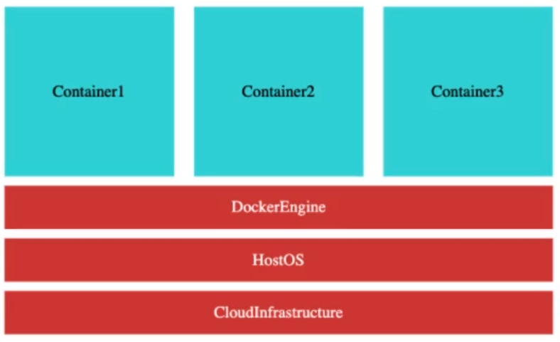

# Introduction (reasons why we need containers)

Enterpresises are heading towards microservices architectures => which involves building multiple small focused microservices that communicate with each other.

- Advantage: One of biggest advantages of microservices is the flexibility to build applications in different programming languages (Java, Go, Python, JavaScript). So we can leverage the unique advantages that each of those languages provide for our specific use-cases.

- Problem: As we implement different microservices in different programming languages - deployments of these microservices become complex.

  - Say [MovieService and Customer Service] are implemented in Java and [the other ones] are implemented in Python. But we don't want different deployment procedures for each of these microservice types.

  - How can we get one common way to deploy all microservices irrespective of the language/framework that is used to build these microservices?

  - That's where containers come into picture. The most popular container tool is Docker.

# Docker

- We can create **Docker images** for each of the microservices that we have

- **Docker image** => contains everything a microservice needs to run:

  - Application runtime (JDK or Python or NodeJS)

  - Application code (ex: JAR for Java applications)

  - Dependecies that you need to run the applcation

- Once you have this Docker image, you can run these as Docker containers, the same way on any infrastructure.

- So, you can run these Docker images on (your local machine, corporate data center, cloud - AWS/Azure/Google Cloud)

