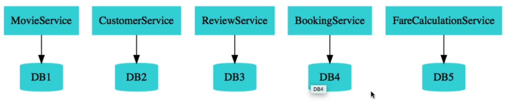

Enterpresises are heading towards microservices architectures -> which involves building multiple small focused microservices that communicate with each other.

- Advantage: One of the biggest advantages of microservices is the flexibility to build applications in different programming languages (Java, Go, Python, JavaScript)

